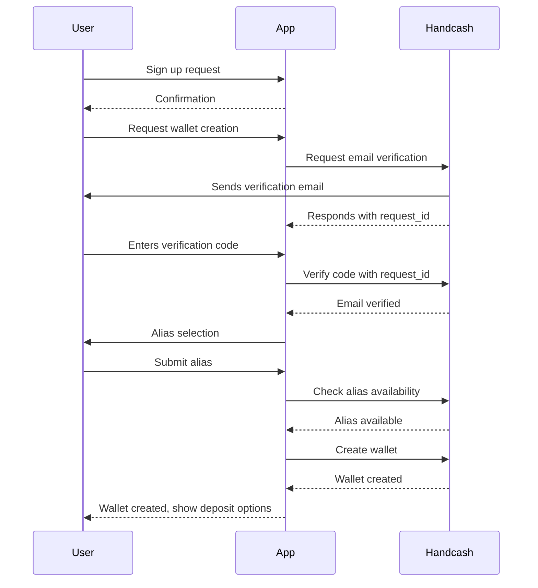

First, set up the WalletService:

```javascript
import { WalletService, Crypto } from '@handcash/sdk';

const walletService = new WalletService({
    appId: '<YOUR-APP-ID>',
    appSecret: '<YOUR-APP-SECRET>',
});
```

## Step 1: Email Verification

Request and verify an email code:

```javascript
// Request email verification code
const email = 'user@example.com';
const requestId = await walletService.requestSignUpEmailCode(email);
// Verify email code
const verificationCode = '01234567'; // Code entered by user
const keyPair = Crypto.generateAuthenticationKeyPair();
await walletService.verifyEmailCode(requestId, verificationCode, keyPair.publicKey);
```

## Step 2: Create and Access Wallet

Create the wallet, store the authentication key, and access the new wallet:

```javascript
// Check if the desired handle is available
const handle = 'userInputAlias';
const isAvailableHandle = await walletService.isAliasAvailable(handle);
if (!isAvailableHandle) {
    throw new Error('Handle is not available');
}
// Create new wallet
await walletService.createWalletAccount(keyPair.publicKey, email, handle);
// Store the authentication key in a secure place so the user can access the wallet later
await storeAuthenticationKey(keyPair.privateKey);
// Get access to the new wallet
const account = walletService.getWalletAccountFromAuthToken(keyPair.privateKey);
```

## Sequence Diagram

The following sequence diagram illustrates the wallet creation process:



This diagram provides a visual representation of the interaction between the User, your App, and Handcash during the wallet creation process.